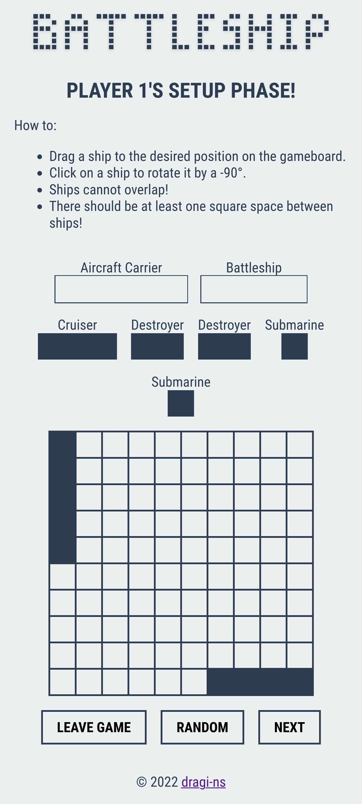

# Battleship - Odin project

[Battleship](<https://en.wikipedia.org/wiki/Battleship_(game)>) implemented in vanila JavaScript with a webpack module bundler. This project was an assignment from [Odin's Full Stack JavaScript path](https://www.theodinproject.com/lessons/node-path-javascript-battleship).

## Screenshots

### Desktop

### Mobile

## Demo

